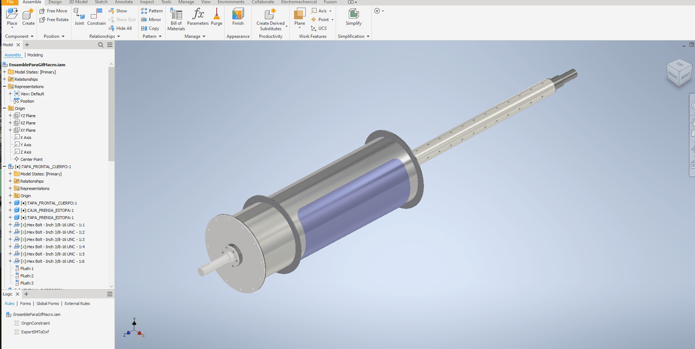

# CommonFolder – Shared Macros for Inventor iLogic Rules

This folder contains **shared VBA macros** that are required by some of the iLogic rules in this repository.  
They provide utility functions (for example, browsing for a folder location) that iLogic rules can call when running.

---

## 🚦 Status
✅ Finished – stable utility macros. More to be added in the near future  
Used across multiple iLogic rules in this repo.  

---

## 📂 Files
- `BrowseFileLocation.bas` → VBA macro that opens a folder selection dialog and returns the selected path.  

---

## 🛠️ Setup
1. Open Autodesk Inventor.  
2. Press `Alt + F11` to open the VBA editor.  
3. Insert a new module into the VBA project.  
4. Copy-paste the contents of the macro file (e.g., `BrowseFileLocation.bas`) into that module.  
5. Save and close the VBA editor.  

---

## 📌 How It Works
- Some iLogic rules in this repo (e.g., **ExportFlatPatternsToDxf**) require the ability to browse for a target folder.  
- Since iLogic alone does not provide a folder dialog, the rule calls this VBA macro.  
- To connect the two, make sure you update the `projectVba` and `moduleVba` variables in the iLogic rule so they match the VBA project and module where this macro is stored.  

---

## 🎥 Demo
  
 
---

## ⚠️ Notes
- The macros in this folder are not meant to be run directly; they are helpers for other tools.  
- If you move the macro to a different project/module, don’t forget to update the variables in any iLogic rule that depends on it.  

---

## 📬 Feedback
If you have suggestions for additional common utilities that could be useful across rules, feel free to open an issue or reach out.  

---
